# Fontes Utilizadas

Esta foi a etapa de curadoria de fontes para a criação do notebook.

Para fins de rapidez no encontro de fontes, fora utilizado o próprio recurso da ferramenta, “Pesquisa do Deep Research” com a frase exata do tema como entrada (“Como Paulo de Tarso contribui para a chegado do cristianismo até o Brasil”).

  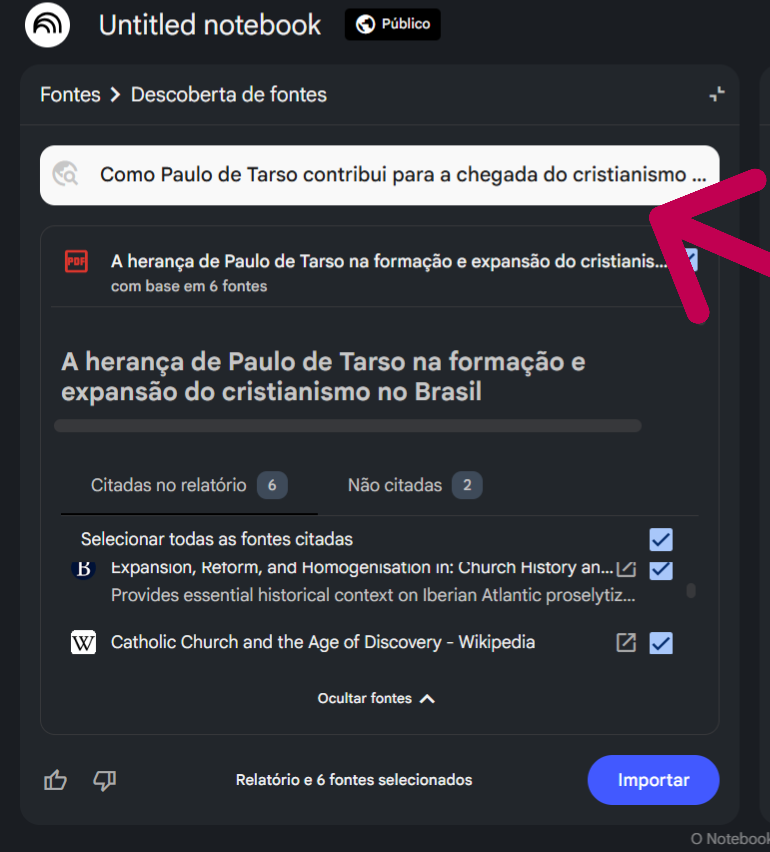

  <em>Imagem 1 – Pesquisa "Deep Research"</em>

O retorno apresentou estudos que envolviam o enfoque na colonização e missões jesuítas no Brasil. O resumo gerado foi de grande importância para a avaliação da incorporação ou não das fontes. 

  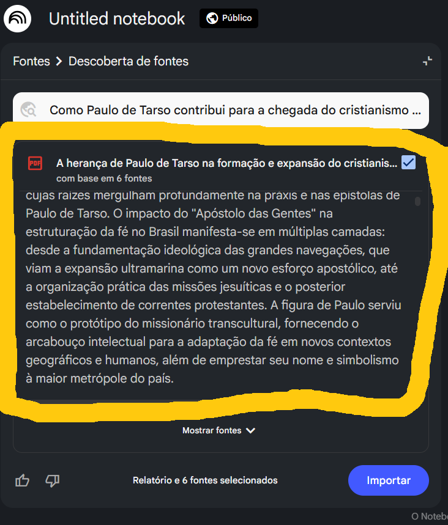

  <em>Imagem 2 – Resumo do Deep Research</em>

Por pertinência, também foi incorporado textos bíblicos para que a relação fosse feita não só em fatos históricos, mas em aspectos religiosos. Porém os livros não foram encontrando inteiros, mas com cada capítulo em uma página web. Por conta disso e pela forma como as fontes são tratadas, a inteligência artificial não indo além do URL fornecido adentrando em tópicos, teve de se utilizar apenas os capítulos dos livros com maior importância (URLs de cada um). A seleção dos capítulos foi com base em uma pergunta a outra IA (ChatGPT) e em conhecimentos pessoais. 

  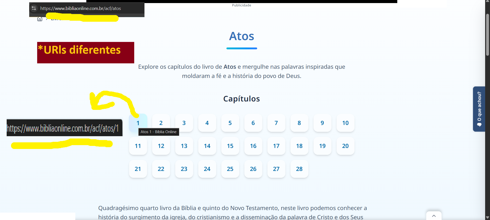

  <em>Imagem 3 – Página web com os capítulos em subpáginas</em>

  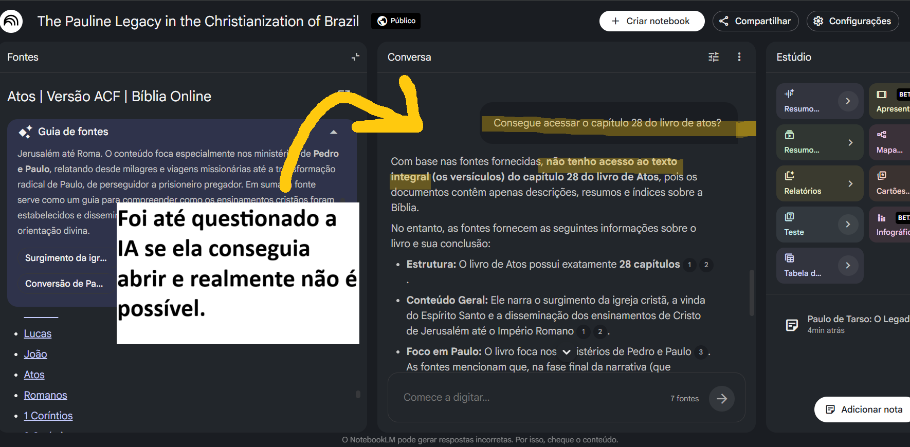

  <em>Imagem 4</em>

Essa fonte, a página "pai", não pode ser usada.

  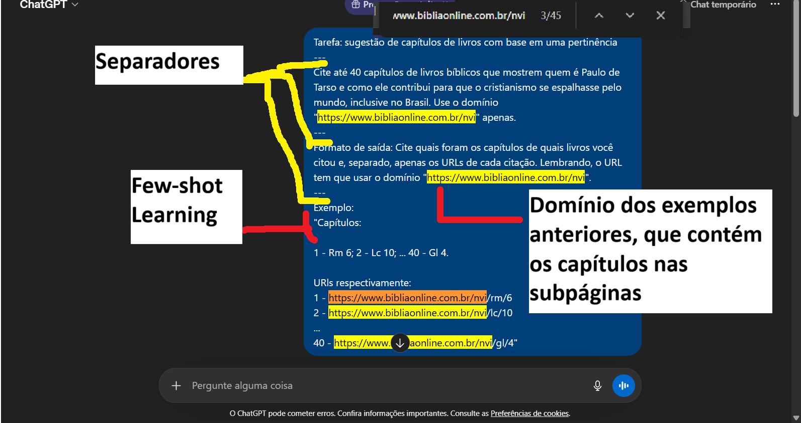

  <em>Imagem 5 – Seleção dos capítulos pelo ChatGPT</em>

 

Como era o plano gratuito, não podia extrapolar o limite de cinquenta fontes. Considerando o que tinha já no material, cinco fontes (excluindo o resumo do deep research), e por precaução caso surgisse outras ideias de fonte, o número de quarenta capítulos foi considerado bom. Aqui já houve uso de engenharia de prompts, que faria diferença principalmente para inserir os URLs. 

  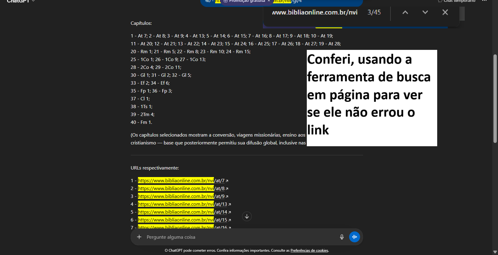

  <em>Imagem 6</em>

O resultado foi exatamente o esperado. Entretanto, foi preciso retirar os números na frente de cada fonte para inserção. 

  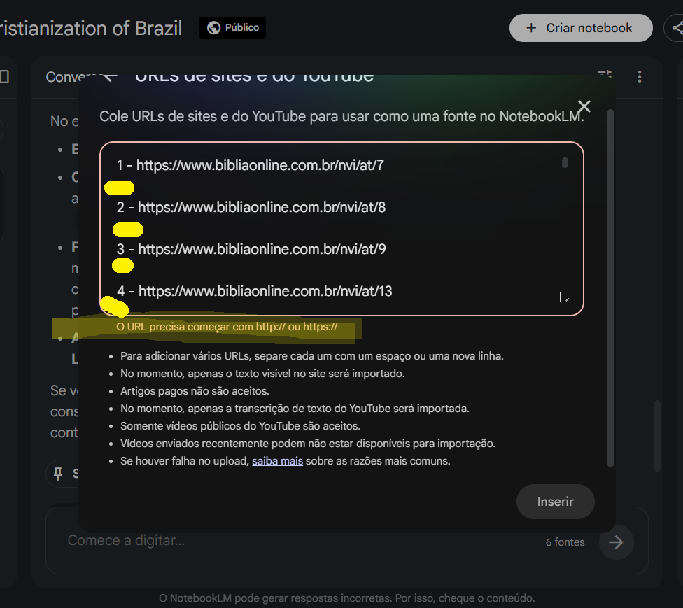

  <em>Imagem 7</em>

Mas ao tentar com as quarenta fontes de uma vez, a aplicação deu erro, um carregamento infinito e depois de atualizar a página, o resultado na imagem a seguir, links não incorporados e mensagem de erro. 

  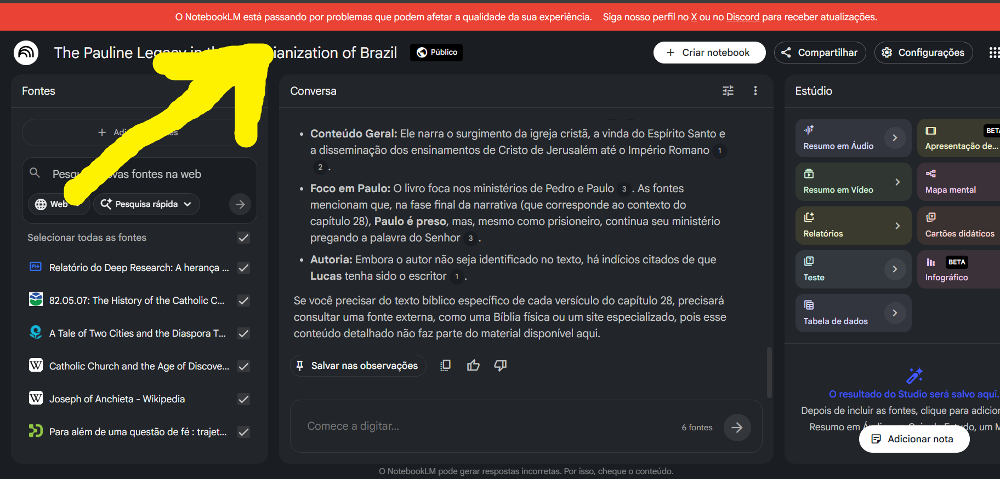

  <em>Imagem 8</em>

Como alternativa para solucionar esse problema foram divididos de dez em dez links para que a tarefa fosse mais leve, deduzindo ser esse o motivo do erro. E realmente funcionou, os links foram adicionados com mais rapidez até. O que ajudou nessa etapa foi a aba de “Notas” no menu inferior direito, em que é possível manipular texto, fazer rascunhos e até incorporar como fonte. 

  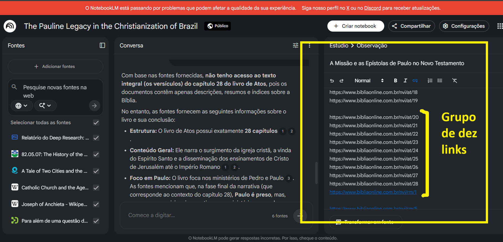

  <em>Imagem 9 – Divisão dos links em grupos, usando uma nota</em>

 

  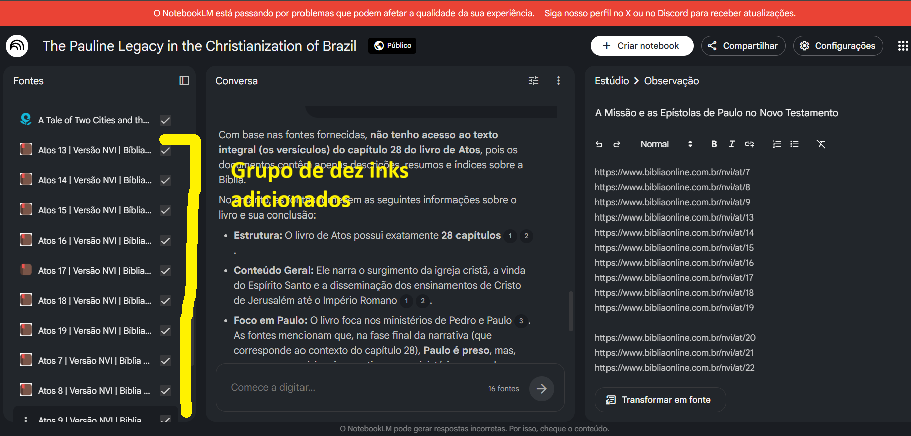

  <em>Imagem 10 - Grupo de dez links adicionados</em>

 

Mesmo assim o erro persistiu no último grupo de links e ainda informando que “Seu notebook atingiu o limite de fontes”, o que de fato não aconteceu. 

  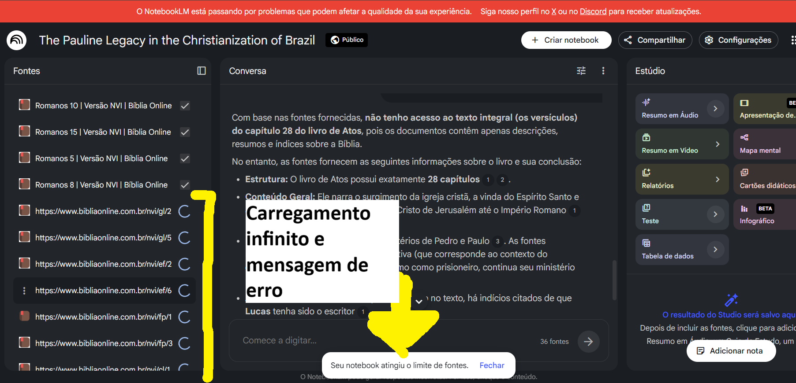

  <em>Imagem 11 – Novamente erro na inserção</em>

 

Ocorreu um pouco de confusão sobre qual fonte tinha de fato entrado ou não, foi solicitado à própria IA do notebook para chegar qual não tinha sido inserida. 

  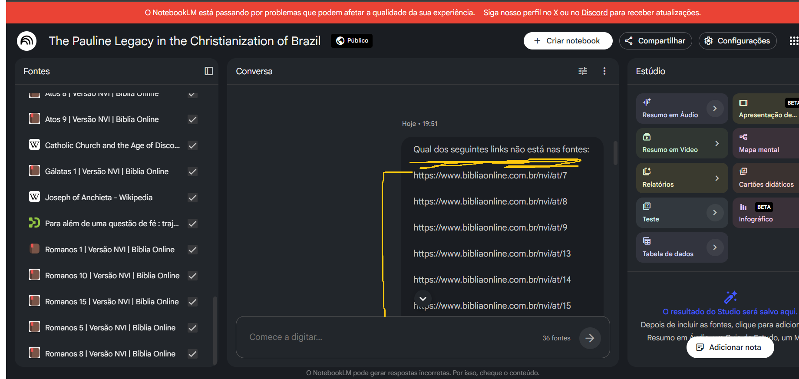

  <em>Imagem 12 – Questionamento das fontes à IA</em>

 

  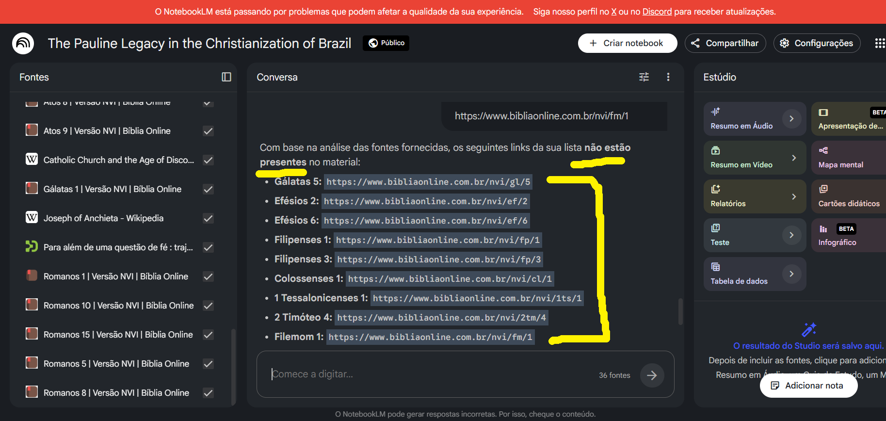

  <em>Imagem 13 – Resposta da IA</em>

Então se dividiu novamente esse grupo de dez em três e duas fontes e foram inseridas separadamente. Então as fontes foram inseridas com sucesso.

Por teste, inseriu-se uma fonte duplicada. Resultou apenas que aparece mais de uma vez, mas no desenvolvimento da IA não se tem conhecimentos dos efeitos. 

  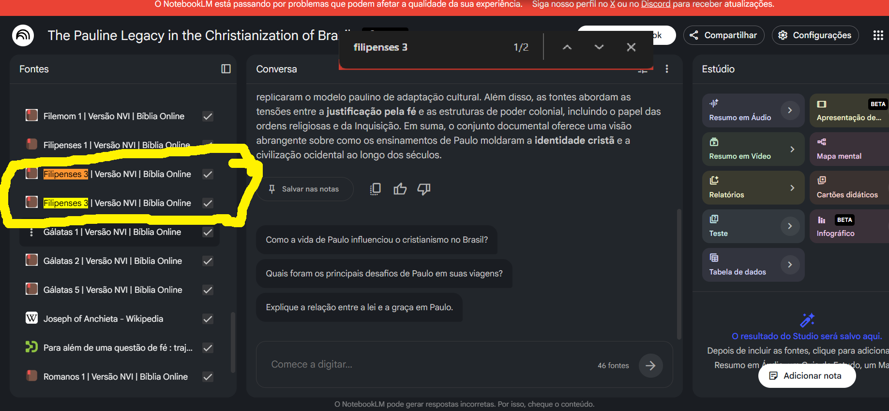

  <em>Imagem 14 – Teste de inserção duplicada</em>

Obs: A tradução NVI foi usada por conta de seu rigor no processo de tradução. Mais informações sobre podem ser consultadas em: https://www.biblica.com/niv-bible/niv-bible-translation-process/ 

No fim de toda a seleção e incorporação de fontes, o resultado contou com quarenta e cinco fontes no total. Algumas das fontes: 

- Primeira carta de Paulo aos coríntios (cap. 1): https://www.bibliaonline.com.br/nvi/1co/1 

- Atos dos Apóstolos (cap.9): https://www.bibliaonline.com.br/nvi/atos/9 

- Guia curricular que examina a trajetória da Igreja Católica na América Latina: https://teachersinstitute.yale.edu/curriculum/units/1982/5/82.05.07.x.html 

---

⬅️ [Anterior: README](README.md) | ➡️ [Próximo: Miniguia de Estudos](03-execucao.md)

🏠 [Voltar ao Sumário](README.md)
