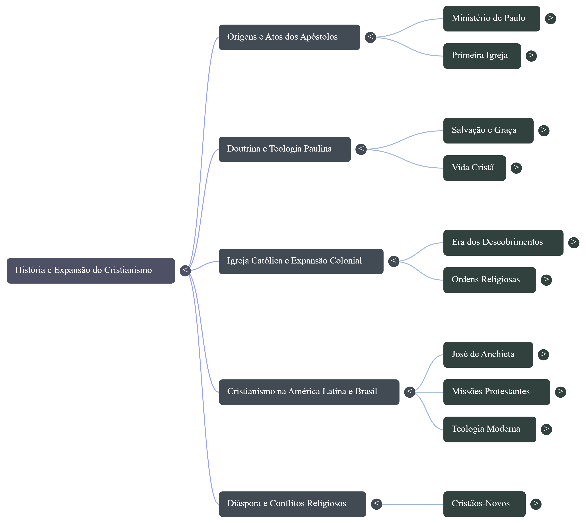
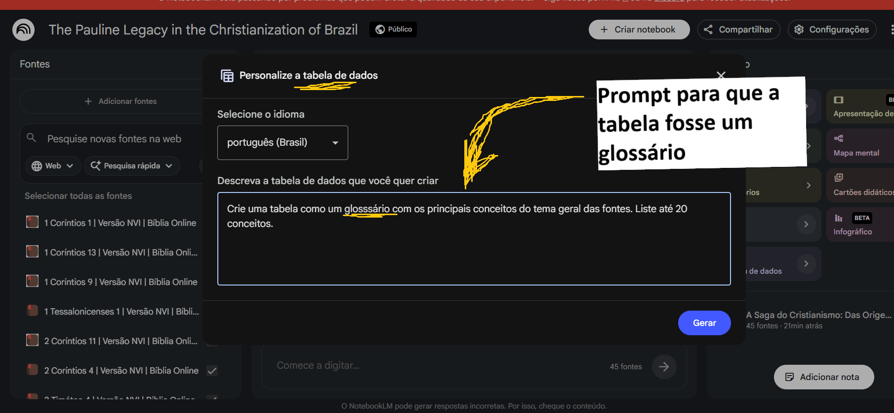
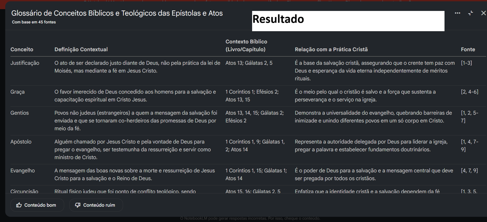
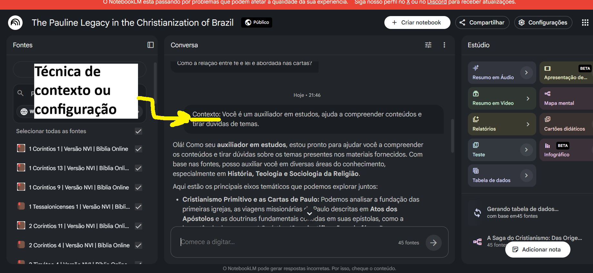
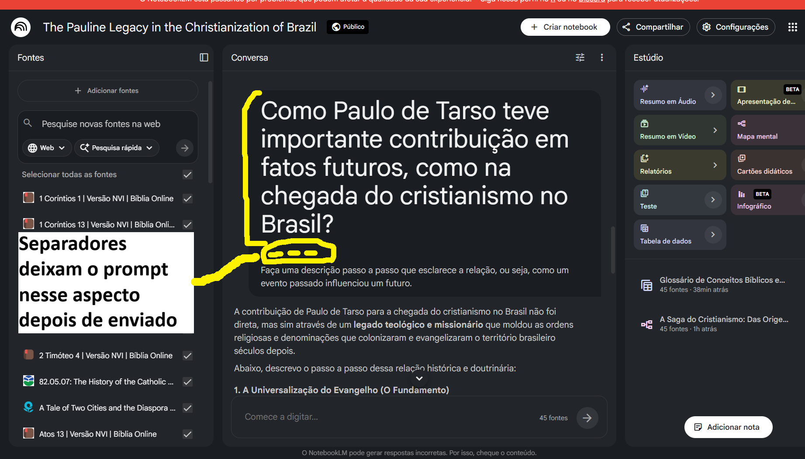
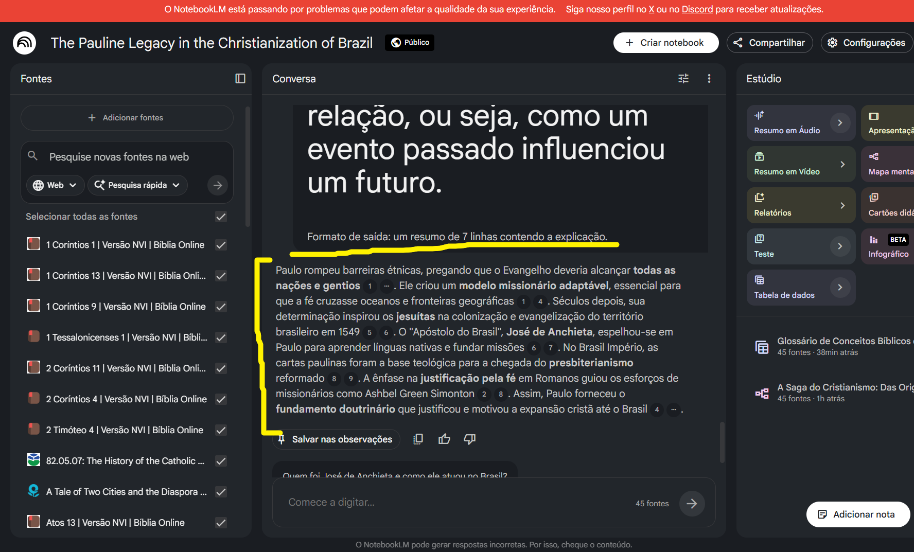

# Miniguia de Estudos

Já com as fontes incorporadas, estava no momento de criar o miniguia de estudos. Com importância não só momentânea, mas para revisões futuras. Por isso a engenharia de prompts foi importante para que os mesmos possam ser reutilizados. 

O miniguia é composto por um resumo estruturado, um glossário com os principais conceitos aprendidos e um conjunto de prompts reutilizáveis. Os quais estarão dispostos, respectivamente, em cada seção a seguir. 

## Resumo estruturado do assunto:

<p align="center">
  
</p>
<p align="center">
  <sub><em>Imagem 15 – Resumo estruturado em forma de mapa mental</em></sub>
</p> 
 

Utilizou-se do recurso “mapa mental” na aba estúdio (aba lateral à direita) sintetiza todo o conteúdo das fontes de forma organizada. 

## Glossário: 

Com o uso de uma ferramenta no estúdio “Tabela de dados” foi criado uma tabela, mas como glossário, conforme o prompt da imagem. Ele não trouxe o significado real, o que aponta que seria necessária a introdução de um dicionário como fonte ou um parâmetro que mudasse isso, mas sim o significado de cada palavra em seu contexto. Porém apresenta-se sim como uma boa forma de estudo.  

<p align="center">
  
</p>
<p align="center">
  <sub><em>Imagem 16</em></sub>
</p>
 
<p align="center">
  
</p>
<p align="center">
  <sub><em>Imagem 17 - O glossário em tabela</em></sub>
</p> 

## Prompts reutilizáveis: 
 
Essa etapa foi usada para atender ao objetivo de estudo. E logo no começo fora usada a técnica de contexto. 
 
<p align="center">
  
</p>
<p align="center">
  <sub><em>Imagem 18</em></sub>
</p>
 

Depois, o prompt para tentar responder à pergunta diretamente foi: 

```
Como Paulo de Tarso teve importante contribuição em fatos futuros, como na chegada do cristianismo no Brasil? 
--- 
Faça uma descrição passo a passo que esclarece a relação, ou seja, como um evento passado influenciou um futuro.
```

<p align="center">
  
</p>
<p align="center">
  <sub><em>Imagem 19 - Primeira tentativa de fazer o prompt reutilizável</em></sub>
</p>
 
Mas como o resultado deu uma resposta grande, preferiu-se um resumo, ainda mais para consultas futuras. Utilizando o seguinte prompt com a técnica formato de saída para limitar o número de linhas: 

 ```
Como Paulo de Tarso teve importante contribuição em fatos futuros, como na chegada do cristianismo no Brasil? 
--- 
Faça uma descrição passo a passo que esclarece a relação, ou seja, como um evento passado influenciou um futuro. 
--- 
Formato de saída: um resumo de 7 linhas contendo a explicação.
```

<p align="center">
  
</p>
<p align="center">
  <sub><em>Imagem 20 - Prompt reutilizável estabelecido</em></sub>
</p>
 
Com isso, o prompt anterior se tornou apto para ser reutilizado em futuros estudos ou revisões.

---

⬅️ [Anterior: Fontes utilizadas](01fontes-utilizadas.md) | ➡️ [Próximo: Troubleshooting](03troubleshooting.md)

🏠 [Voltar ao Sumário](README.md)
